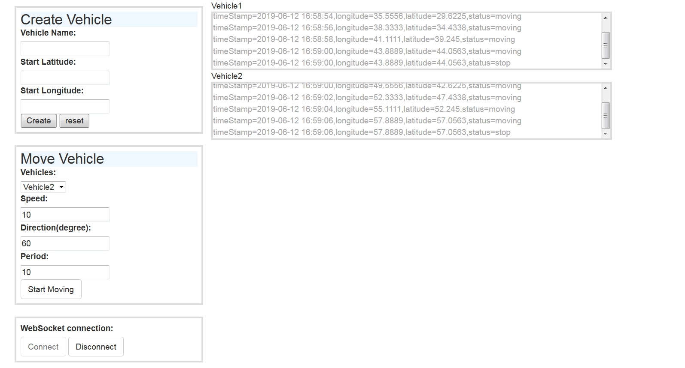

#Preface 
This a demo project to present my skills in distributed system development using Sprin Boot, Active MQ Messaging server, WebSockets, Design Patterns.

#Project Definition

#Project Structure
 
 From coding and implementation perspective the project is divided to three modules.

   - tba-msg directory is contained with the code of "Vehicle Simulation" component of the system as defined in technical 
    design document at  [docs/technical-design.docx](docs/technical-design.docx)
    
   - tba-web directory is contained with the code of "Terminal Web Application" component of the system as defined in technical 
     design document at  [docs/technical-design.docx](docs/technical-design.docx)
   - tba-common directory is contained withe code the both tba-msg module and tba-web is dependent on.
   - docs directory is documents directory for the project.    

# TBA Case Installation Guide
In this document we assume that you already downloaded and  installed
the lasted JDK from Oracle web site. The JDK version should be at least 1.8.

Then you should do the following steps to get the application running.

1. ActiveMQ Installation & Configuration
2. Maven Installation
3. Building application
4. Running tba-msg module
5. Running tba-web module
6. Browse web Console

#1. ActiveMQ Installation & Configuration
    a.Download ActiveMQ from https://activemq.apache.org/components/classic/download/
    b.Extract the archive file to a directory of your choice.
    c. Open a command prompt or terminal and change directory to
        apache-activemq-5.15.9\bin
    d.Run activemq create tbabroker
        it creates a fresh broker to be used by application
    e.Run activemq start
    
#2. Maven Installation
Download Maven from https://maven.apache.org/download.cgi and extract the archive to your 
directory of choice.

put apache-activemq-5.15.9\bin in system path.

#3.Building Application 
   Open a command prompt or terminal and change directory 
   to project directory. Run the following command
    
    mvn package   
         
   after running aboove command you will see some output on console indicating that
   the build is in progress and at the end you should see build successful message.
        
#4. Running tba-msg module
   This is the vehicle simulation component of the system and you should run the following command.Note that you should have ActiveMQ running before.
    
    cd <PROJECT_DIRECTORY> 
    java -jar tba-msg/target/tba-msg-0.0.1-SNAPSHOT.jar
         
#5. Running tba-web module     
   This is the terminal web application component of the system and you should run the follow command.Note that you should have ActiveMQ running before.
   
    cd <PROJECT_DIRECTORY>
    java -jar tba-web/target/tba-web-0.0.1-SNAPSHOT.jar

#6. Browse the web console
   Open the following link in your browser of choice. The system have been tested with firefox but supposed 
   to work in other HTML 5.0 compatible Browsers.
    
    http://localhost:8080/console.html
    
   
    
   Consult Users Guide document for learning how to use the system.You can find the users guide at
   <PROJECT_DIRECTOR>/docs/user-guide.docx    
